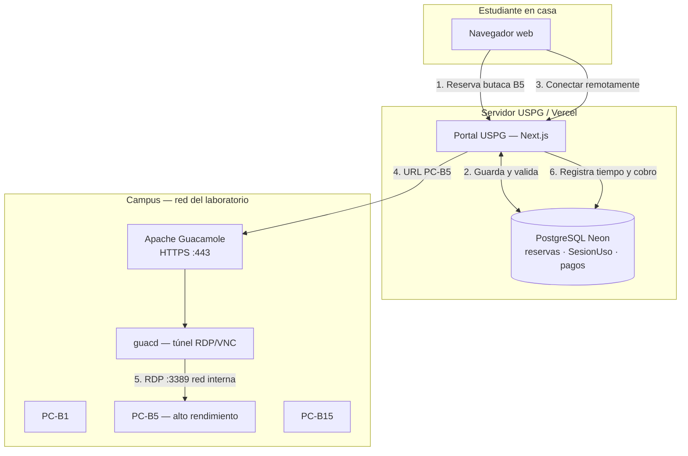
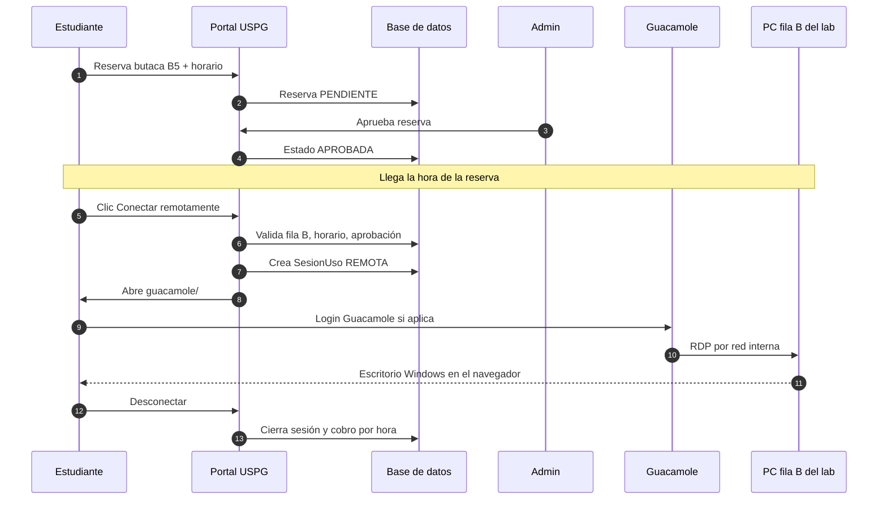
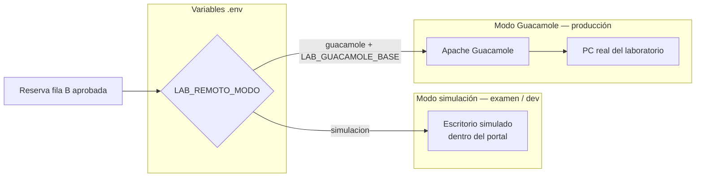
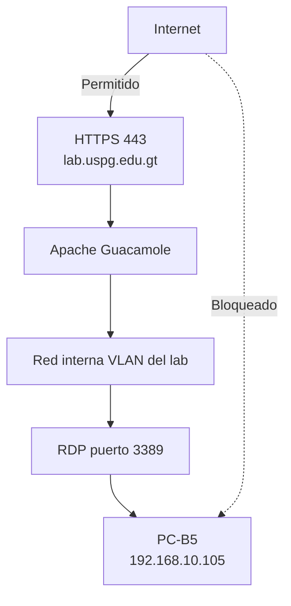
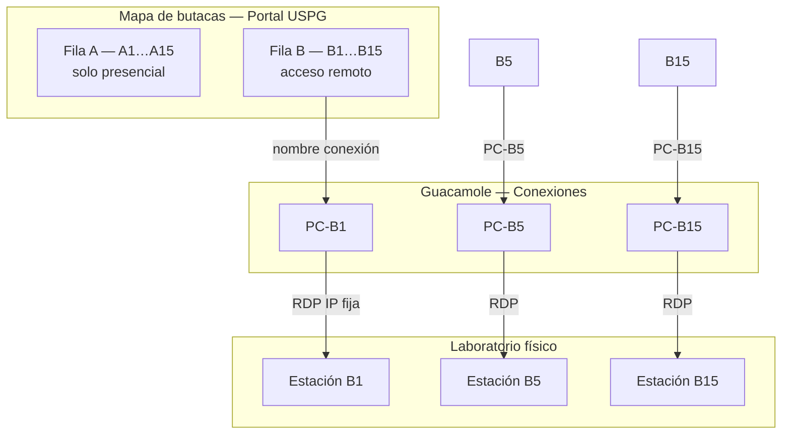
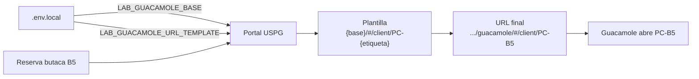

# Diagramas — Acceso remoto USPG + Guacamole

Diagramas visuales del flujo de reserva, conexión remota y arquitectura de red.

> Ver también: [GUIA_ENTORNO_REAL.md](./GUIA_ENTORNO_REAL.md)

---

## 1. Vista general (componentes)

---

## 2. Flujo paso a paso (reserva → escritorio)

---

## 3. Dos modos del portal (simulación vs Guacamole)

---

## 4. Red y seguridad (producción)

**Regla:** el estudiante nunca se conecta por RDP directo a la PC. Solo entra a Guacamole por HTTPS.

---

## 5. Mapa butaca ↔ conexión Guacamole ↔ PC física

El **nombre** de la conexión en Guacamole debe coincidir con la plantilla URL:

`LAB_GUACAMOLE_URL_TEMPLATE={base}/#/client/PC-{etiqueta}`

Butaca **B5** → conexión **PC-B5** → URL `.../PC-B5`.

---

## 6. Construcción de la URL de conexión

---

## Cómo ver estos diagramas renderizados

| Herramienta | Uso |
|-------------|-----|
| **GitHub** | Abre este `.md` en el repo; GitHub renderiza Mermaid |
| **VS Code / Cursor** | Extensión "Markdown Preview Mermaid Support" |
| **Mermaid Live** | Copia un bloque en https://mermaid.live |
